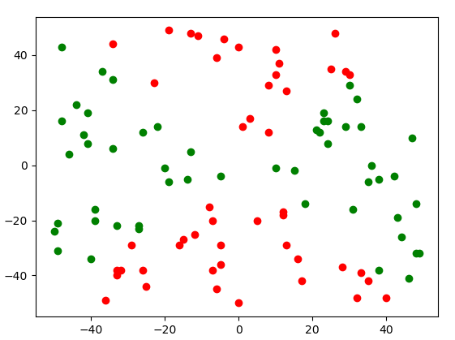

# Simple Perceptron

**Goal**

Goal is to better understand Perceptrons and how they function

**Perceptron**

Create a perceptron which will output either a 1 (*on*) or a -1 (*off*).
Random Points will be generated on a cartesian plane which will train the
perceptron. Additional points will be generated to Test the perceptron.

**Untrained Runs**

**Trained Runs**

